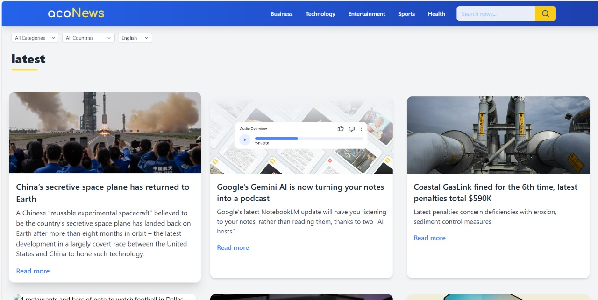

# acoNews


acoNews is a responsive news website that fetches and displays news articles from the GNews API. It provides a clean and modern interface for browsing different categories of news, including general, world, nation, business, technology, entertainment, sports, science, and health.

## Project Links
- **Live Website (Hosted on Firebase):** [acoNews](https://aconews-23afc.web.app/)
- **GitHub Repository:** [GitHub Repo](https://github.com/Paku0718/acoNews)

## Screenshots

### Homepage


### Newsfeed


## Table of Contents
- [Project Setup](#project-setup)
- [Project Overview](#project-overview)
- [Challenges and Solutions](#challenges-and-solutions)

## Project Setup

### Prerequisites
Ensure you have the following installed:
- [Node.js](https://nodejs.org/)
- [Firebase CLI](https://firebase.google.com/docs/cli)

### Installation

1. Clone the repository:
   ```bash
   git clone https://github.com/yourusername/aconews.git
   cd aconews
